### 스프링 부트(Spring Boot) 기초 강의
https://www.youtube.com/watch?v=7t6tQ4KV37g  
https://www.youtube.com/watch?v=1Jc-SD9YrV4

---

### 생성 패턴  
생성 패턴은 객체의 생성과 관련된 패턴  
특정 객체가 생성되거나 변경되어도 프로그램 구조에 영향을 최소화할 수 있도록 유연성 제공  

| 생성 패턴                   |의도| 
|:------------------------|---|  
 | 추상 팩토리 (Abstract Factory)|구체적인 클래스를 지정하지 않고 인터페이스를 통해 연관되는 객체들을 묶어줌|  
| 빌더 (Bulilder)           |객체의 생성과 표현을 분리하여 객체를 생성|  
| 팩토리 메소드 (Factory Method)|객체 생성을 서브클래스로 분리하여 위임 (캡술화)|  
| 프로토타입 (Prototype)       |원본 객체를 복사하여 객체를 생성 (클론)|  
| 싱글톤 (Singleton)         |한 클래스마다 인스턴스를 하나만 생성하여 어디서든 참조|  
---
### 행동(행위) 패턴  
|행동 패턴|의도|
|---|---|
|책임 연쇄 (Chain of Responsibility)|요청을 받는 객체를 연쇄적으로 묶어 요청을 처리하는 객체를 만날 때까지 객체 Chain을 따라 요청을 전달|
|커맨드 (Command)|요청을 객체의 형태로 캡술화하여 재사용하거나 취소|
|인터프리터 (Interpreter)|특정 언어의 문법 표현을 정의|
|박복자 (lterator)|컬렉션 구현 방법을 노출하지 않으면서 모든 항목에 접근할 수 있는 방법을 제공|
|중재자 (Mediator)|한 집합에 속해있는 객체들의 상호작용을 캡술화하여 새로운 객체로 정의|
|메멘토 (Memento)|객체가 특정 상태로 다시 되돌아 올 수 있도록 내부 상태를 실체화|
|옵저버 (Observer)|객체 상태가 변할 때관련 객체들이 그변화를 전달받아 자동으로 갱신|
|상태 (State)|객체의 상태에 따라 동일한 동작을 다르게 처리|
|전략 (Strategy)|동일 계열의 알고리즘군을 정의하고 캡술화하여 상호 교환이 가능하게 함|
|템플릿 메소드|상위 클래스는 알고리즘의 골격만을 작성하고 구체적인 처리는 서브 클래스로 위임|
|방문자 (Visitor)|객체의 원소에 대해 수행할 연산을 분리하여 별도의 클래스로 구성|
---
### 구조 패턴
구조 패턴은 프로그램 내 자료구조나 인터페이스 구조 등 프로그램 구조를 설계하는데 사용되는 패턴
클래스나 객체를 조합하여 더 큰 구조를 만들 수 있게 해줌  

|구조 패턴 | 의도                                                             |
|---|----------------------------------------------------------------|
|어댑터 (Adapter) | 클래스의 인터페이스를 어떤 클래스에서든 이용할 수 있도록 변환                             |
|브리지 (Bridge) | 구현부에서 추상층을 분리하여 각자 독립적으로 변형하고 확장할 수 있도록 함                      |
|컴포지트 (Composite) | 객체들의 관계를 트리 구조로 구성하여 표현하는 방식으로 복합 객체와 단일 객체를 구분없이 다름           |
|데코레이터 (Decorator) 파사드 (Facade) | 주어진 상황에 따라 객체에 다른 객체를 덧붙임 서브 시스템에 있는 인터페이스 집합에 대해 통합된 인터페이스 제공 |
|플라이웨이트 (Flyweight) |  크기가 작은 여러 개의 객체를 매번 생성하지 않고 최대한 공유하여 사용하도록 메모리 절약             |
|프록시 (Proxy)| 실제 기능을 수행하는 객체 대신 가상의 객체를 사용해 로직의 흐름을 제어                       |
---
### API (Application Programming Interface)
- 응용 프로그램에서 사용할 수 있도록 다른 응용 프로그램을 제어할 수 있게 만든 인터페이스를 뜻함  
*인터페이스: 어떤 장치간 정보를 교환하기 위한 수단이나 방법(마우스, 키보드 등)  
- API 를 사용하면 내부 구현 로직을 알지 못해도 정의되어 있는 기능을 쉽게 사용할 수 있음

### REST (Representational State Transfer)
- 자원의 이름으로 구분하여 해당 자원의 상태를 교환하는 것을 의미
- 서버와 클라이언트의 통신 방식 중 하나
- HTTP URI를 통해 자원을 명시하고 HTTP Method를 통해 자원을 교환하는 것  
*HTTP Method : Create, Read, Update, Delete

### REST 특징
- Server-Client 구조
- Stateless : client 정보가 서버에 저장X
- Cacheable
- 계층화(Layered System) : 로드밸런싱, 보안요소, 캐시 등
- Code on Demand(Optional) : 요청을 받으면 서버에서 client로 코드 또는 스크립트(로직)을 전달하여 client 기능 확장
- 인터페이스 일관성(Uniform Interface)

### REST 장점
- HTTP 표준 프로토콜을 사용하는 모든 플랫폼에서 호환 가능
- 서버와 클라이언트 역활을 명확히 분리
- 여러 서비스 설계에서 생길 수 있는 문제 최소화

### REST API
- REST 아키텍처의 조건을 준수하는 어플리케이션 프로그래밍 인터페이스를 뜻함  
*일반적으로 REST 아키텍처를 구현하는 웹 서비스를 RESTful 하다고 표현

### REST API 특징
- REST 기반으로 시스템을 분산하여 확장성과 재사용성을 높임
- HTTP 표준을 따르고 있어 여러 프로그래밍 언어로 구현 가능

### REST API 설계 규칙
- 웹 기반의 REST API를 설계할 경우 URI를 통해 자원 표현  
ex) https://xxx.studio/member/589  
Resource : memeber  
Resource id : 589

- 자원에 대한 조작은 HTTP Method(CRUD)를 통해 표현  
URI에 행위가 들어가면 안됨

- 메세지를 통한 리소스 조작  
HEADER를 통해 content-type을 지정하여 데이터 전달(HTML, XML, JSON, TEXT 등)

### REST API 설계 규칙
- URI는 소문자 사용
- Resource의 이름이나 URI가 길어질 경우 하이픈(-) 사용
- 언더바(_) 사용하지 않음
- 파일 확장자 표현하지 않음

### @RestController
- @Controller + @ResponseBody
- Controller 하위 메소드에 @ResponseBody를 붙이지 않아도 문자열과 JSON 등 전송 가능
- View를 거치지 않고 HTTP ResponseBody에 직접 return 값을 담아 보냄

### @RequestMapping
- 클래스와 메소드의 RequestMapping을 통해 URL을 매핑하여 경로를 설정하여 해당 메소드에서 처리
- value : url 설정
- method : GET, POST, DELETE, PUT, PATCH 등

### @PathVariable
- GET 형식의 요청에서 파라미터를 전달하기 위해 URL에 값을 담아 요청하는 방법

### @RequestParam
- GET 형식의 요청에서 쿼리 문자열을 전달하기 위해 사용되는 방법
- '?'를 기준으로 우측에 {키}={값} 형태로 전달, 복수 형태로 전달할 경우 & 사용

---

### Swagger
- 서버로 요청되는 API 리스트를 HTML 화면으로 문서화하여 테스트 할 수 있는 라이브러리
- 이 라이브러리는 서버가 가동되면서 @RestController를 읽어 API를 분석하여 HTML 문서를 작성함

- 2.x.x 버전: http://localhost:8080/swagger-ui.html
- 3.x.x 버전: http://localhost:8080/swagger-ui/index.html

---

### ResponseEntity
- Spring Framework에서 제공하는 클래스 중 HttpEntity라는 클래스를 상속받아 사용하는 클래스
- 사용자의 HttpRequest에 대한 응답 데이터를 포함
- 포함하는 클래서(HttpStatus, HttpHeaders, HttpBody)

---

### Lombok
- 반복되는 메소드를 Annotation을 사용하여 자동으로 작성해주는 라이브러리

>### @NoArgsConstructor
>- 파라미터가 없는 생성자를 생성
>
>### @AllArgsConstructor
>- 모든 필드값을 파라미터로 갖는 생성자를 생성
>
>### @RequiredArgsConstructor
>- 필드값 중 final이나 @NotNull인 값을 갖는 생성자를 생성
>
>### @ToString
>- toString 메소드를 자동으로 생성해주는 기능
>- exclude 속성으로 특정 필드를 toString에서 제외 시킬 수 있음
>
>### @EqualsAndHashCode
>- equals, hashCode 메소드를 자동 생성
   >  - equals : 두 객체의 내용이 같은지 동등성(equality)를 비교
>  - hashCode : 두 객체가 같은 객체인지 동일성(identity)를 비교
>  - callSuper 속성을 통해 메소드 생성시 부모 클래스의 필드까지 고려할지 여부 설정 가능
     >    - callSuper = true 이면 부모 클래스 필드 값들도 동일한지 체크함
>
> ### @Data
> - @Getter, @Setter, @RequiredArgsConstructor, @ToString, @EqualsAndHashCode 기능을 한번에 추가

---

### Entity(Domain)
- DB에 쓰일 컬럼과 여러 엔티티 간의 연관관계를 정의

### Repository
- Entity에 의해 생성된 DB에 접근하는 메소드를 사용하기 위한 인터페이스
- DB에 적용하고자 하는 CRUD를 정의하는 영역

### DAO(Data Access Object)
- DB에 접근하는 객체를 의미
- Service가 DB에 연결할 수 있게 해주는 역할
- DB를 사용하여 데이터를 조회하거나 조작하는 기능을 전담

### DTO(Data Transfer Object)
- DTO는 VO(Value Object)로 불리기도 하며, 계층간 데이터 교환을 위한 객체를 의미
- VO의 경우 Read Only의 개념을 가지고 있음

---

### ORM
- 어플리케이션의 객체와 관계형 DB의 데이터를 자동으로 매핑해주는 것을 의미
  * Java의 데이터 클래스와 관계형 DB의 테이블을 매핑
- 대표적으로 JPA, Hibernate 등이 있다.(Persistent API)

### ORM 장점
- 쿼리가 아닌 직관적인 코드로 데이터 조작 가능
  - 비즈니스 로직에 집중 가능 
- 재사용 및 유지보수 편리
  - ORM은 독립적으로 작성되어 있어 재사용 가능
  - 매핑정보를 명확하게 설계하기 때문에 따로 DB를 볼 필요 없음
- DBMS에 대한 종속성이 줄어듬
  - DBMS를 교체하는 작업을 비교적 적은 리스크로 수행 가능

### ORM 단점
- 복잡성이 커질 경우 ORM만으로 구현 어려움
- 잘못 구현할 경우 속도 저하 발생
- 대형 쿼리는 별도의 튜닝이 필요할 수 있음

### JPA (Java Persistance API) - ORM과 관련된 인터페이스 모음

### Hibernate - ORM Framework 중 하나
- JPA의 실제 구현체 중 하나이며, JPA 구현체 중 가장 많이 사용됨

### Spring Data JPA
- Spring Framework에서 JPA를 편리하게 사용할 수 있게 지원하는 라이브러리

---

### Logback
- Log4J를 기반으로 개발된 로깅(Logging) 라이브러리
- 출시순서 : log4j -> logback -> log4j2

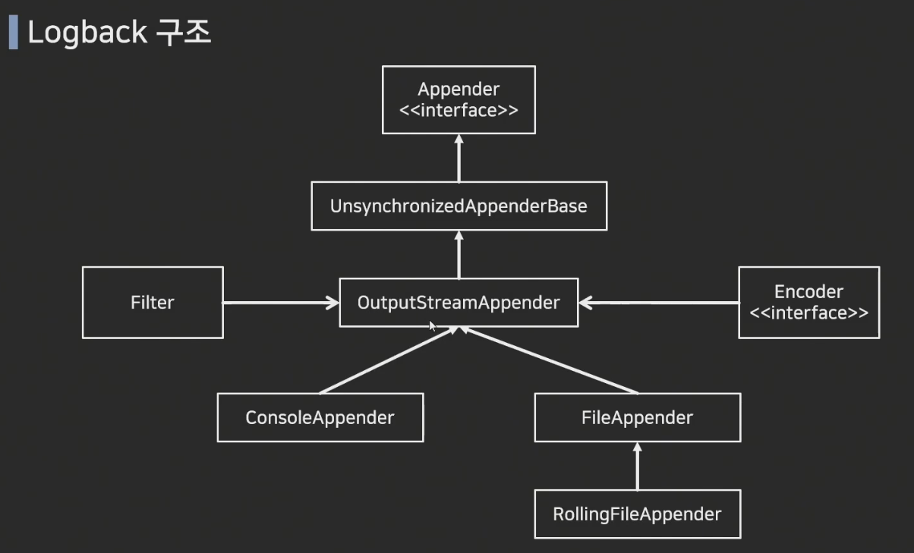

### Logback 특징
- 로그에 특정 레벨 설정 가능(Trace -> Debug -> Info -> Warn -> Error)
- 실운영과 테스트 상황에서 각각 다른 출력 레벨 설정 가능
- 출력 방식 설정 가능
- 설정 파일을 일정 시간마다 스캔하여 어플리케이션 중단 없이 설정 변경 가능
- 자체적으로 로그 압축 지원
- 로그 보관 기간 설정 가능

### Logback 설정
- 일반적으로 Classpath에 있는 logback 설정 파일 참조
  - Java Legacy, Spring은 logback.xml 참조
  - Spring Boot는 logback-spring.xml 참조

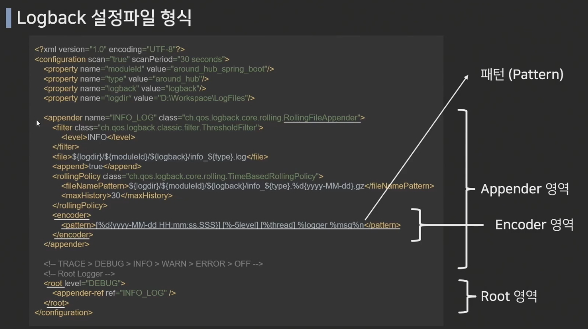

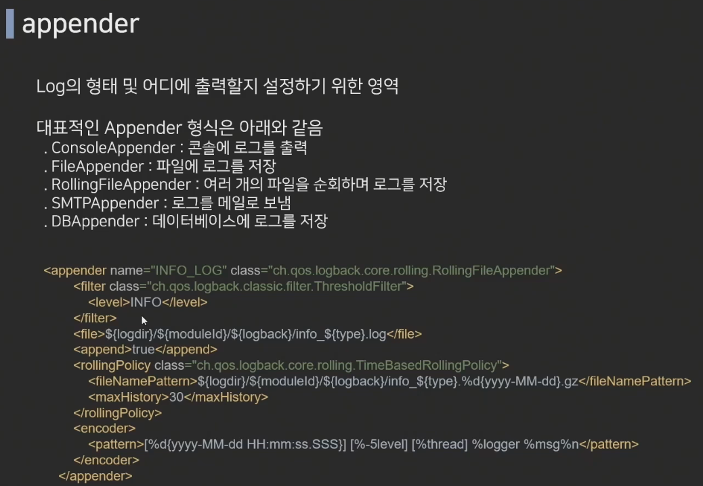

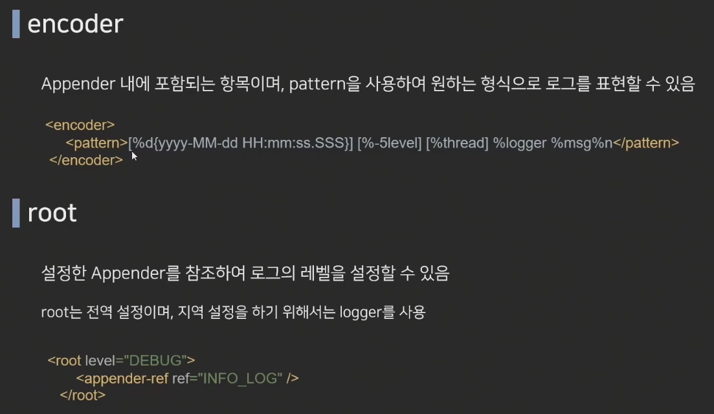

### 로그 레벨
TRACE -> DEBUG -> INFO -> WARN -> ERROR
- ERROR : 시스템적으로 심각한 문제가 발생하여 작동이 불가한 경우
- WARN : 시스템 에러의 원인이 될 수 있는 경고 레벨, 처리 가능한 사항
- INFO : 상태변경과 같은 정보성 메시지
- DEBUG : 어플리케이션의 디버깅을 위한 메시지 레벨
- TRACE : DEBUG 레벨 보다 더 디테일한 메시지를 표현하기 위한 레벨
참고 : INFO로 설정 시, TRACE, DEBUG는 출력 안됨

### pattern
|패턴|설명|
|---|---|
|%Logger{length} | Logger Name|
|%-5level | 로그 레벨, -5는 출력의 고정폭 값|
|%msg| 로그 메세지 영역 (==%message)|
|${PID|-} | 프로세스 id|
|%d | 로그 기록 시간 |
|%p | 로깅 레벨|
|%F| 로깅이 발생한 프로그램 파일명 |
|%M | 로깅이 발생한 메소드의 이름 |
|%l| 로깅이 발생한 호출지의 정보|
|%L| 로깅이 발생한 호출지의 라인 수|
|%thread | 현재 Thread 명|
|%t | 로깅이 발생한 Thread 명 %c| 로깅이 발생한 카테고리 %C | 로깅이 발생한 클래스 명 %m| 로그 메시지|
|%n| 줄바꿈|
|%% | % 출력|
|%r|어플리케이션 실행 후 로깅이 발생한 시점까지의 시간|

예시) <pattern>[%d{yyyy-MM-dd HH:mm:ss.SSS}] [%-5level] [%thread] %logger{30} %msg%n</pattern>

---

### 유효성 검사 / 데이터 검증 (Validation)
- 서비스의 비즈니스 로직이 올바르게 동작하기 위해 사용되는 데이터에 대한 사전 검증하는 작업이 필요함
- 들어오는 데이테에 대해 의도한 형식의 값이 제대로 들어오는 지 체크하는 과정을 뜻함

| 어노테이션                     | 설명                   |
|---------------------------|----------------------|
| @Size                     | 문자의 길이 조건            |
| @NotNull                  | null                 |
| @NotEmpty                 | @NotNull + "" 값 불가   |
| @NotBlank                 | @NotEmpty + " " 값 불가 |
|                           |
| @Past                     | 과거 날짜                |
| @PastOrPresent            | @Past + 오늘 날짜        |
| @Future                   | 미래 날짜                |
| @FutureOrPresent          | @Future + 오늘 날짜      |
|                           |
| @Pattern                  | 정규식을 통한 조건           |
| @Max                      | 최대값 조건 설정            |
| @Min                      | 최소값 조건 설정            |
| @AssertTrue / AssertFalse | 참/거짓 조건 설정           |
| @Valid                    | 해당 객체의 유효성 검사        |


---

### Exception
- @ControllerAdvice를 통한 모든 Controller에서 발생할 수 있는 예외 처리
- @ExceptionHandler를 통한 특정 Controller의 예외 처리
- 
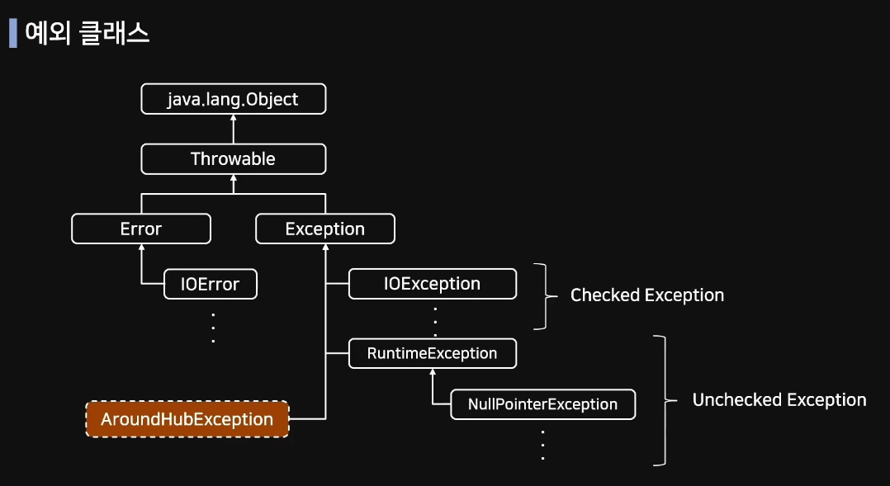
### Exception class
모든 예외 클래스는 Throwable 클래스를 상속받고 있음

||Checked Exception|Unchecked Exception|
|-|---|---|
|처리여부|반드시 예외 처리 필요|명시적 처리 강제하지 않음|
|확인시점|컴파일 단계|실행 중 단계|
|예외발생시 트랜잭션|롤백하지 않음|롤백함|
|대표예외|IOException<br/>SQLExeption|NullPointerException<br/>Illegal ArgumentException<br/>IndexOutOfBoundException<br/>SystemException|

### @ControllerAdvice, @RestControllerAdvice
- Spring에서 제공
- @Controller, @RestController에서 발생하는 예외를 한 곳에서 관리하고 처리할 수 있게 하는 어노테이션
- 설정을 통해 범위 지정 가능(@RestControllerAdvice(basePackages="com.example.testproject") 와 같이 패키지 범위 설정 가능

### @ExceptionHandler
- 예외 처리 상황 발생 시 해당 Handler로 처리하겠다는 것을 명시하는 어노테이션
- 어떤 ExceptionClass를 처리할지 설정 가능(@ExceptionHandler(OOException.class))
- Exception.class는 최상위 클래스로 하위 세부 예외 처리 클래스로 설정한 핸들러가 존재하면 그 핸들러가 우선처리하게 되면 처리된지 못하는 예외 처리에 대해 ExceptionClass에서 핸들링함
- @ControllerAdvice로 설정된 클래스 내에서 메소드로 정의할 수 있지만 각 Controller 안에 설정도 가능
- 전역 설정(@ControllerAdvice)보다 지역 설정(Controller)으로 정의한 Handler가 우선순위를 가짐

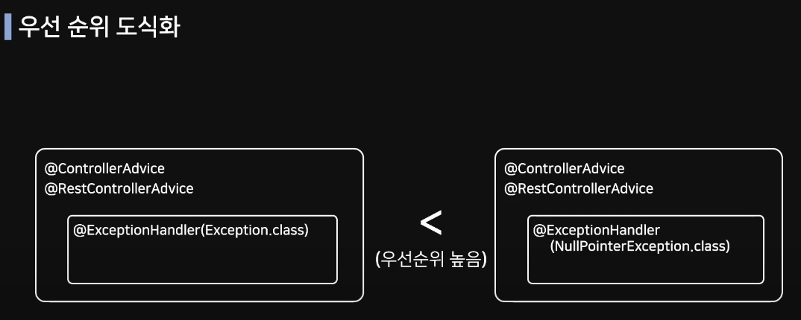

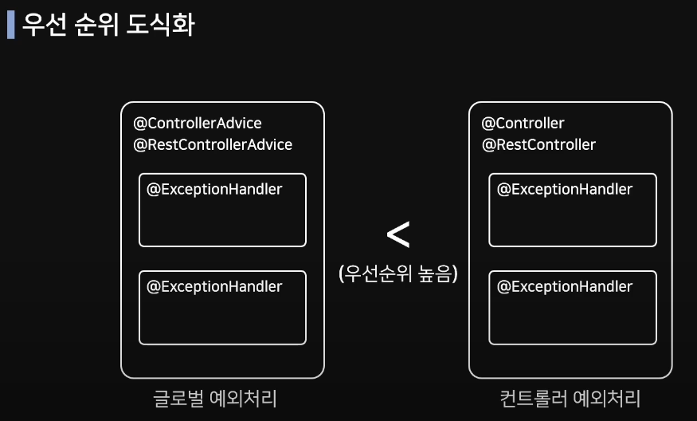

---

### Rest Template
- 스프링에서 제공하는 HTTP 통신 기능을 쉽게 사용할 수 있게 설계되어 있는 템플릿
- HTTP 서버와의 통신을 단순화하고 RESTful 원칙을 지킴
- 동기 발식으로 처리되며, 비동기 방식으로 AsyncRestTemplate이 있음
- RestTemplate 클래스는 REST 서비스를 호출하도록 설계되어 HTTP 프로토콜의 메소드에 맞게 여러 메소드 제공

| Method         | HTTP   | 설명                                       |
|----------------|--------|------------------------------------------|
| getForObject   | GET    | GET 형식으로 요청하여 객체로 결과를 반환 받음              |
| getForEntity   | GET    | GET 형식으로 요청하여 ResponseEntity로 결과를 반환 받음  |
| postForObject  | POST   | POST 형식으로 요청하여 객체로 결과를 반환 받음             |
| postForEntity  | POST   | POST 형식으로 요청하여 ResponseEntity로 결과를 반환 받음 |
| delete         | DELETE | DELETE 형식으로 요청                           |
| put            | PUT    | PUT 형식으로 요청                              |
| patchForObject | PATCH  | PATCH 형식으로 요청                            |
| exchange       | any    | HTTP 헤더를 생성하여 추가할 수 있고 어떤 형식에서도 사용할 수 있음 |

### 실행 방법
serverBox / testproject 를 각각 실행하여 postman 또는 swagger로 테스트

---

### TDD
- 테스트 주도 개발(테스트를 먼저 설계 및 구축 후 테스트를 통과할 수 있는 코드를 짜는 것)

### 테스트 코드 작성 목적
- 코드 안전성을 높임
- 기능 추가, 변경 과정에서 발생할 수 있는 side-effect 감소
- 해당 코드가 작성된 목적을 명확하게 표현 가능

### JUnit
- Java 진영의 대표적은 Test Framework
- 단위 테스트(Unit Test)를 위한 도구를 제공
  - 단위 테스트란?
    - 코드의 특정 모듈이 의도된 대로 동작하는지 테스트 하는 절차를 의미
    - 모든 함수와 메소드에 대한 각각의 테스트 케이스를 작성하는 것
- Annotation(어노테이션)을 기반으로 테스트 지원
- 단정문(Assert)으로 테스트 케이스의 기대값에 대해 수행 결과를 확인할 수 있음
- JUnit5는 크게 Jupiter, Platform, Vintage 모듈로 구성

### JUnit Jupiter
- TestEngin API 구현체로 JUnit5를 구현하고 있음
- 테스트의 실제 구현체는 별도 모듈 역학을 수행하는데, 그 모듈 중 하나가 Jupiter-Engine
- 이 모듈은 Jupiter-API를 사용하여 작성한 테스트 코드를 발견하고 실행하는 역할을 수행
- 개발자가 테스트 코드를 작성할 때 사용됨

### JUnit Platform
- Test를 실행하기 위한 뼈대
- Test를 발견하고 테스트 계획을 생성하는 TestEngine 인터페이스를 가지고 있음
- TestEngine을 통해 Test를 발견하고, 수행 및 결과를 보고하고, 각종 IDE 연동을 보조하는 역할을 수행(콘솔 출력 등)

### JUnit Vintage
- TestEngine API 구현체로 JUnit 3,4를 구현하고 있음
- 기존 JUnit 3,4 버전으로 작성된 테스트 코드를 실행할 때 사용됨
- Vintage-Engine 모듈을 포함하고 있음


### JUnit LifeCycel Annotation
| Annotation | Description                              |
|------------|------------------------------------------|
| @Test      | 테스트용 메소드를 표현하는 어노테이션|
| @BeforEach | 각 테스트 메소드가 시작되기 전에 실행되어야 하는 메소드 표현|
| @AfterEach | 각 테스트 메소드가 시작 된 수 실행되어양 하는 메소드를 표현|
| @BeforAll  | 테스트 시작 전에 실행되어야 하는 메소드를 표현(static 처리 필요)|
| @AfterAll  | 테스트 종료 후에 실행되어야 하는 메소드를 표현(static 처리 필요)|

### JUnit Main Annotation
>### @SpringBootTest
> - 통합 테스트 용도록 사용됨
> - @SpringBootApplication을 찾아가 하위의 모든 Bean을 스캔하여 로드
> - 그 후 Test용 Application Context를 만들어 Bean을 추가하고, MockBean을 찾아 교체
> 
> @ExtendWith
> - JUnit4에서 @RunWith로 사용되던 어노테이션이 ExtendWith로 변경
> - @ExtendWith는 메인으로 실행될 Class를 지정할 수 있음
> - @SpringBootTest는 기본적으로 @ExtendWith가 추가되어 있음
> 
> @WebMvcTest(Class명.class)
> -()에 작성된 클래스만 실제로 로드하여 테스트를 진행
> 매개변수를 지정해주지 않으면 @Controller, @RestController, @RestControllerAdvice 등 컨트롤러와 연관된 Bean이 모두 로드됨
> 스프링의 모든 Bean을 로드하는 @SpringBootTest 대신 컨트롤러 관련 코드만 테스트할 결우 사용
> 
> @Autowired about Mockbean
> - Controller의 API를 테스트하는 용도인 MockMvc 객체를 주입 받음
> - perform() 메소드를 활용하여 컨트롤러의 동작을 확인할 수 잇음
> - .andExpect(), aneDo(), andReturn() 등의 메소드를 같이 활용
> 
> @MockBean
> - 테스트할 클래스에서 주입 받고 있는 객체에 대해 가짜 객체를 생성해주는 어노테이션
> - 해당 객체는 실제 행위를 하지 않음
> - given()메소드를 활용하여 가짜 객체의 동작에 대해 정의하여 사용할 수 있음
> 
> @AutoConfigureMockMvc
> - spring.test.mockmvc의 설정을 로드하면서 MockMvc의 의존성을 자동으로 주입
> - MockMvc 클래스는 REST API 테스트를 할 수 있는 클래스
> 
> @Import
> - 필요한 Class들을 Configuration으로 만들어 사용할 수 있음
> - Configuration Component 클래스도 의존성 설정할 수 있음
> - Import된 클래스는 주입으로 사용 가능

### 통합 테스트
- 여러 기능을 조합하여 전체 비즈니스 로직이 제대로 동작하는지 확인하는 것을 의미
- @SpringBootTest 사용하여 진행
  - @SpringBootTest는 @SpringBootApplication을 찾아가서 모든 Bean을 로드하게 됨
  - 이 방법을 대규모 프로젝트에서 사용할 경우, 테스트를 실행할 때마다 모든 빈을 스캔하고 로드하는 작업이 반복되어 매번 무거운 작업을 수행해야 함

### 단위 테스트
- 프로젝트에 필요한 모든 기능에 대한 테스트를 각각 진행하는 것을 의미
- 일반적으로 스프링 부트에서는 'org.springframework.boot:spring-boot-starter-test' 디펜던시만으로 의존성을 모두 가질 수 있음

- F.I.R.S.T 원칙
  - Fast : 테스트 코드의 실행은 빠르게 진행되어야 함
  - Independent : 독립적인 테스트가 가능해야 함
  - Repeatable : 테스트는 매번 같은 결과를 만들어야 함
  - Self-Validation : 테스트는 그 자체로 실행하여 결과를 확인할 수 있어야 함
  - Timely : 단위 테스트는 비즈니스 코드가 완성되기 전에 구성하고 테스트가 가능해야 함  
    (코드가 완성되기 전부터 테스트가 따라와야 한다는 TDD의 원칙을 담고 있음)

---

### 코드 커버리지
- 소프트웨어의 테스트 수준이 충분한지 표현할 수 있는 지표 중 하나
- 테스트를 진행했을 때 해당 코드가 실행되었는지를 표현하는 방법

### Jacoco
- Java 코드의 커버리지를 체크하는 라이브러리
- 작성된 코드의 테스트 커버리지(Test Coverage)를 측정하는 도구
- Runtime으로 Test Case를 실행하여 Coverage를 체크하는 방식으로 사용됨
- 테스트 코드를 통해 테스트를 실행하고 그 결과를 html, xml, csv등의 형식으로 Report를 제공

### 블랙 박스 테스트
- 소프트웨어의 내부 구조나 작동 원리를 모르는 상태에서 동작을 검사하는 방식
- 다양한 값을 입력하여 올바른 출력이 나오는지 테스트
- 사용자 관점의 테스트 방법

### 화이트 박스 테스트
- 소프트웨어의 내부 구조와 동작을 검사하는 테스트 방식
- 소프트웨어 내부 소스 코드를 테스트하는 방법
- 개발자 관점의 테스트 방법

### Jacoco pom.xml 파일 설정
- Execution 내부에 사용되는 값
- prepare-agent
  - 테스트 중인 어플리케이션에서 인수를 전달하는 Jacoco Runtime Agent에 대한 property를 준비
- merge : 여러 실행 데이터 파일들을 하나로 통합하는 명령어
- report : 하나의 프로젝트 테스트에 대한 Code Coverage 리포트를 생성하는 명령어
- check : code coverage metric이 충돌하는 지 확인하는 명령어

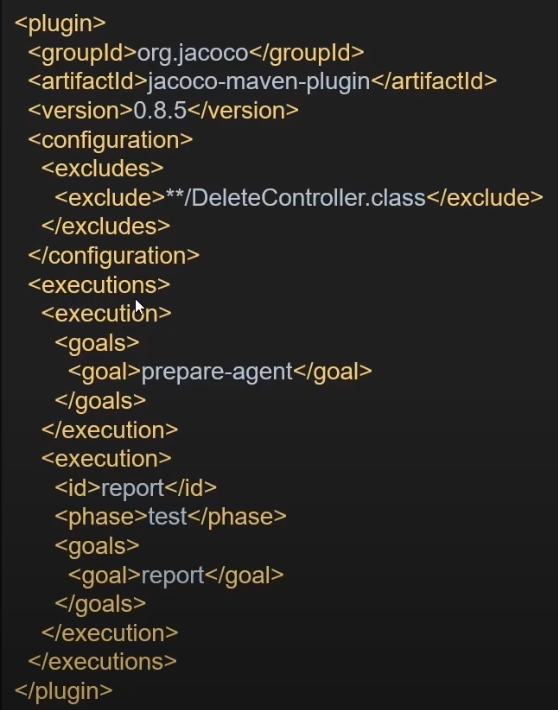

### Jacoco Rule
>- Element type - 코드 커버리지 체크 기준
>  - BUNDLE (default) : 패키지 번들
>  - PACKAGE : 패키지
>  - CLASS : 클래스
>  - SOURCEFILE : 소스 파일
>  - METHOD : 메소드
>
> - Counter - 코드 커버리지를 측정할 때 사용하는 지표
>   - LINE : 빈 줄을 제외한 실제 코드의 라인 수
>   - BRANCH : 조건문 등의 분기 수
>   - CLASS : 클래스 수
>   - METHOD : 메소드 수
>   - INSTRUCTION (default) : Java 바이트 코드 명령 수 
>   - COMPLEXITY : 복잡도
> 
> - Value - 커버리지 정도를 나타내는 지표
>   - TOTALCOUNT : 전체 개수
>   - MISSEDCOUNT : 커버되지 않은 개수
>   - COVEREDCOUNT : 커버된 개수
>   - MISSEDRATIO : 커버되지 않은 비율(0~1)
>   - COVEREDRATIO (default) : 커버된 비율(0~1)

### Jacoco 설정 예시
- 특정 클래스 테스트 대상에서 제외하기 위해 다음과 같이 설정

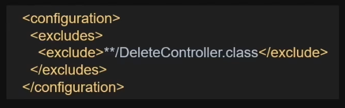

다음과 같이 측정 기준을 설정할 수 있다.
<rule>을 기준으로 총 2개의 측정 기준이 제시된 예제

상단 <rule> 의미 : 패키지 번들 단위로 바이트 코드 명령 수에 40% 미만일 경우 에러 발생
하단 <rule> 의미 : 메소드 라인 수가 30을 초과할 경우 에러 발생

### Jacoco 와 Maven LifeCycle
- Maven의 라이프 사이클
  - complie -> test -> package -> intall -> deploy
- Jacoco 플로그인은 Maven 라이프 사이크에 의해 동작하며, test phase 이후에 측정 가능
  - package phase 이후로 동작 가능

---

### 스프링
- 의존성 주입(DI, Dependency Injection)과 제어역전(IOC, Inversion Of Control), 관점 지향 프로그래밍(AOP)이 가장 중요한 요소
- 이 요소를 통해 느슨한 결합(Loose Coupling)을 달성할 수 있으며 단위 테스트를 수행하기 용이하다.

### 의존성 주입(DI, Dependency Injection)
- 다음과 같은 코드에서 Controller는 'MyService'객체에 의존하게 되고 객체 간의 결합도가 높아지며 단위 테스트를 위해 Mock 객체를 사용할 수 없게 된다.

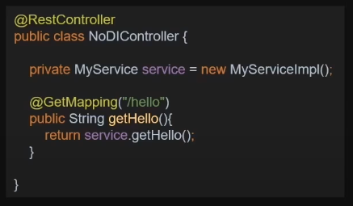

- 다음과 같이 DI를 사용하는 경우 @Service, @Autowired를 통해 MyService의 인스턴스를 획득하며 단위 테스트 상황에서 Service 객체를 Mock 객체로 대체하여 쉽게 테스트가 가능하다.

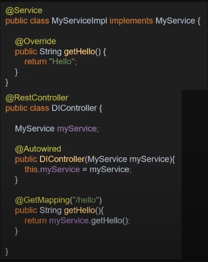

### 관점 지향 프로그래밍(AOP, Aspect Oriented Programming)
- OOP를 보완하는 수단으로 여러 곳에 쓰이는 공통 기능을 모듈화하여 필요한 곳에 연결함으로써 유지보수 또는 재사용에 용이하도록 하는 것을 의미
- 결합도를 낮춘 개발이 가능함

### 스프링 프레임워크의 대표적 모듈
- Spring JDBC
- Spring MVC
- Spring AOP
- Spring ORM
- Spring Test
- Spring Expression Language (SpEL)

### 스프링 부트가 나오게 된 이유
> Spring Boot makes it easy to create stand-alone, production-grade Spring based Application that you can "just run".
> 스프링 부트는 단지 실행만 하면 되는 스프링 기반의 어플리케이션을 쉽게 만들 수 있다.

- 스프링은 다양한 기능르 제공하고 있지만, 그 기능을 사용하기 위한 설정에 많은 시간이 걸림
ex) Transaction Manager, Hibernate Datasource, Entity Manager, Session Factory 등

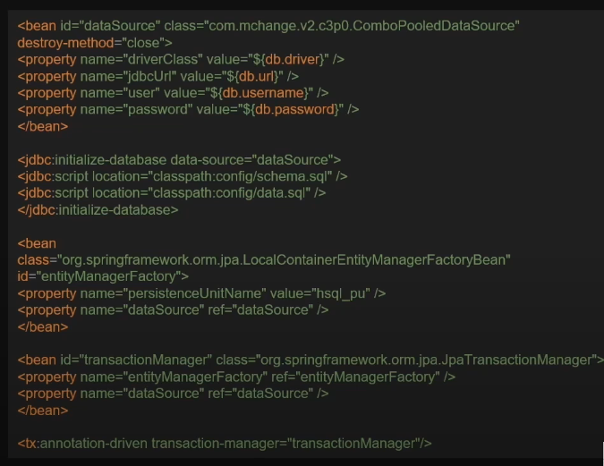
Hibernate 관련 spring 설정

### 스프링 부트가 제공하는 기능
- 스프링 부트는 자동설정을 이용
  - 어플리케이션 개발에 필요한 모든 디펜던시(Dependency)를 프레임워크에서 관리
  - jar 파일 클래스 패스에 있는 경우 스프링 부트는 Dispatcher Servlet으로 자동 구성됨
  - 스프링 부트는 미리 설정되어 있는 Starter 프로젝트를 제공
  - xml 설정 없이 자바 코드를 통해 설정할 수 있음
- 어플리케이션을 개발하면서 사용되는 디펜턴시들은 호환되는 버전으로 관리해줘야 함
  - 이런 복잡도를 줄이기 위해 스프링 부트는 SpringBoot-Starter를 제공하여 자동으로 호환되는 버전을 관리
- 모니터링 관리를 위한 스프링 액추에이터(Spring Actuator) 제공
  - 서비스가 정상적으로 동작하는지 상태 모니터링 제공
  - 스프링 액추에이터는 스프링 부트에서 제공하는 상태 정보를 보다 쉽게 모니터링할 수 있게 기능 제공

### 스프링 부트 프로젝트의 의존성 관리
- spring boot starter dependency를 통해 다양한 패키지를 수용하고 있음
- 이를 통해 개발자는 dependency 관리(호환성 체크 등)에 대해 고려할 필요가 없어짐

### 스프링 부트 프로젝트의 starter 디펜던시
- spring-boot-starter-web-service : SOAP 웹 서비스
- spring-boot-starter-web : RESTful 응용 프로그램
- spring-boot-starter-test : 단위 테스트, 통합 테스트
- spring-boot-starter-jdbc : 기본적인 JDBC
- spring-boot-starter-security : 스프링 시큐리티(인증, 권한)
- spring-boot-starter-data-jpa : Spring Data JPA(Hibernate)
- spring-boot-starter-data-cache : 캐시

---

### @MappedSuperclass
- 여러 엔티티 객체에서 사용되는 공통 속성은 대표적으로 id, createdAt, updatedAt 이 있다.
- 공통되는 속성을 별도의 클래스로 구분하여 @MappedSuperclass를 선언 후 사용
- 코드 상 분리, DB의 테이블 개념에서는 분리되어 있지 않음

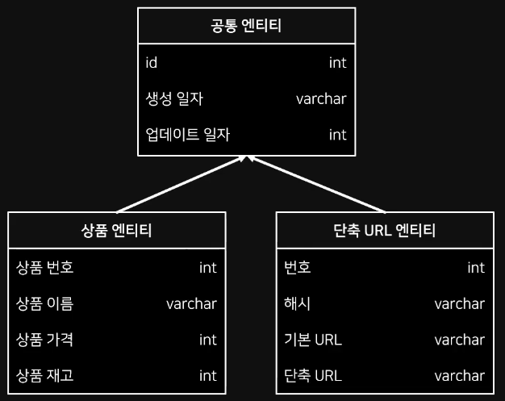

### Auditing
- JPA에서의 Auditing은 각 엔티티 별로 누가, 언제 접근했는지 기록하여 감시 체계를 꾸리는 것을 의미
- Spring Data JPA에서 이 기능을 사용하기 위해서는 @EnableJpaAuditing 사용

### @EntityLitener
- 엔티티 객체를 DB에 적용하기 전/후에 콜백을 요청하는 어노테이션
- @EntityLitener의 파라미터로 콜백을 요청할 클래스를 지엉하여 사용
- @EntityLitener의 요청 시점은 다음과 같다.

|EntityListener|설명|
|---|---|
|@PostLoad|Select 실행 직후|
|@PrePersist|Persist(Insert)|
|@PostPersist|Persist(Insert)|
|@PreUpdate|Merge(Update)|
|@PostUpdate|Merge(Update)|
|@PreRemove|Remove(Delete)|
|@PostRemove|Remove(Delete)|

### JPA Auditing Annotation
- @CreatedDate : 엔티티가 저장되는 시점에 자동으로 시간 주입
- @CreatedBy : 엔티티가 저장되는 시점에 저장 주체가 누구인지 주입
- @LastModifiedDate : 엔티티가 수정되는 시점에 자동으로 시간 주입
- @LastModifiedBy : 엔티티가 수정되는 시점에 수정 주체가 누군인지 주입

---

### JPQL (Java Persistence Query Language)
- 테이블이 아닌 엔티티 객체를 대상으로 사용되는 객체지향 쿼리
- JPA는 JPQL을 분석한 후 연동되어 있는 DB에 맞는 SQL로 가공하여 사용

### 쿼리 메소드
- Spring Data JPA의 핵심 기능
- Repository 내 정의되는 메소드의 이름만으로 쿼리를 생성할 수 있음
- 이름 짓는 것에는 특별한 규칙이 존재(네이밍 컨벤션)하면, 규칙에 맞게 이름을 지으면 그에 맞는 쿼리가 자동 생성됨

### 쿼리 메소드 문법
- 뭐리 메소드는 크게 주제(Subject)와 서술어(Predicate)로 구분
- 'find...by', 'exists...by'와 같은 키워드로 주제를 정하며 by는 서술어의 시작을 나타냄
- 서술어 영역은 검색 및 조건을 작성

### 쿼리 메소드의 주제 키워드
>find...by, read...by, get...by, query...by 등
- 조회 기능을 수행하는 키워드
- '...'의 영역은 엔티티를 표현할 수 있으나 Repository에서 이미 엔티티를 정의하고 있기 때문에 생략하는 경우가 있음
- return 타입 : Collection이나 Streamable에 속하는 타입을 설정할 수 있음
>exists...by
- 특정 데이터가 존재하는지 확인
- return 타입 : boolean
>count...by
- 조회 쿼리를 수행한 후 결과 개수를 리턴하는 키워드
- return 타입 : long
>delete...by, remove...by
- 삭제 쿼리를 수행
- return 타입 : 없거나 삭제한 횟수를 return
>First<number>..., ...Top<number>...
- 쿼리를 통해 조회되는 결과값의 수를 제한하는 키워드
- 일반적으로 여러 건을 조회하기 위해 사용되지만 단 건으로 조회할 경우 <number> 부분을 생략하면 된다.

### 쿼리 메소드의 조건자 키워드
>Is
- 값을 일치를 위한 조건자 키워드
- Equals 키워드와 통일한 기능 수행
>(Is)Not
- 값의 불일치를 위한 조건자 키워드
- Is는 생략하고 Not 키워드만 사용할 수 있음
>(Is)Null, (Is)NotNull
- 해당 컬럼의 레코드의 값이 Null인지 아닌지 체크하는 키워드
>(Is)True, (Is)False
- boolean 타입으로 지정되어 있는 컬럼의 값을 확인하는 키워드
>And, Or
- 여러 조건을 묶을 때 사용
>(Is)GreaterThan, (Is)LessThan, (Is)Between
- 숫자나 DateTime 컬럼에서 사용할 수 있는 비교 연산 키워드
- 경계값을 포함하기 위해서는 Equal 키워드를 추가해야 함
>(Is)StartingWith(==StartWith), (Is)EndingWith(==EndingWith), (Is)Containing(==Containing), (Is)Like
- 컬럼의 값에서 값이 일부 일치하는지 확인하는 키워드
- SQL 문으로 가공될 때 Containing 키워드는 양 끝, StartingWith는 앞, EndingWith은 뒤에 %가 포함됨
- Like 키워드는 %를 명시적으로 기입해줘야 함

---

### 쿼리문에서의 정렬
- 일반적으로 정렬을 사용하기 위해서 'ORDER BY' 구문 사용
- 특정 컬럼을 기준으로 오름차순 또는 내림차순으로 정렬된 레코드 목록을 응답 받음

### 쿼리 메소드에서 정렬 처리
- 메소드 이름으로 정렬 처리 설정 가능
  - Asc : 오름차순
  - Desc : 내림차순
  - ex) findByNameOrderByStockAsc
- 여러 정렬 기준을 사용하고 싶다면 이어 붙이는 것으로 설정 가능  
ex) findByNameOrderByStockAscPriceDesc

### 매개 변수를 활용한 정렬 처리
- 메소드 이름에 정렬 키워드를 넣는 방법이 아닌 Sort 객체를 활요하여 정렬 기준으로 설정할 수 있음   
ex) findByName(String name, Sort sort)
- findByName("pen", Sort.by(Order.asc("price")));

### 매개 변수를 활용한 페이징 처리
- 페이징 처리를 하면 리턴 타입으로 Page를 설정하고 매개변수로 Pageable 객체를 사용  
ex) findByName(String name, Pageable pageable);
- findByName("공책", PageRequest.of(0,2));  

PageRequest의 of 메소드는 아래와 같이 설명할 수 있다.

| of 메소드                                                   |매개변수 설명|비고|
|----------------------------------------------------------|---|---|
| of(int page, int size)                                   |페이지 번호(zero-based), 페이지당 데이터 개수|정렬x|
| of(int page, int size, Sort)                             |페이지 번호, 페이지당 데이터 개수, 정렬|sort에 의해 정렬|
| of(int page, int size, Direction, String ... properites) |페이지 번호, 페이지당 데이터 개수, (enum) 정렬 방향, 컬럼|Sort.by(direction, properties)에 의해 정렬|

---

### @Query 어노테이션
- Spring Data JPA에서 제공하는 기능으로 JPQL을 사용하여 쿼리를 작성하는 방법
- JPQL은 엔티티 객체를 대상으로 쿼리를 수행

### 문법 - 기본 쿼리 작성방법(메소드명은 어떻게 작성하든 상관없다.)
- 직접 쿼리를 사용하는 방법  


- DB의 Native Query를 사용하는 방법
  

- 파라미터를 쿼리에 주입하는 방법  
  

- parameter 방식으로 주입하는 방법  
  

참고 : https://docs.spring.io/spring-data/jpa/docs/current-SNAPSHOT/reference/html/#jpa.query-methods.at-query

---

### Jasypt
- 개발자가 암호화 작동 방식에 대한 깊은 지식 없이도 최소한의 노력으로 자신의 프로젝트에 기본 암호화 기능을 추가할 수 있도록 하는 Java 라이브러리
- 특징
  - 간편하게 단방향 및 양방샹 암호화 기술 제공
  - 스레드로부터 안전함
    - 스프링 같은 싱글톤 환경에서 동기화 걱정없이 사용할 수 있음
  - 원본 문자 집합에 대한 제약없이 사용 가능함(일본어, 한국어 등의 언어 지원)

### Jasypt 사용법
1. 라이브러리 추가
2. Configuration 클래스 생성
3. 속성값 암호화  
www.devglan.com/online-tools/jasypt-online-encryption-decryption  
위 사이트 사용 또는 아래 코드 사용
```
void encryptTest(){
  String id = "root";
  String password = "djfkdnsemgjqm";
  
  System.out.println(jasyptEncoding(id));
  System.out.println(jasyptEncoding(password));
}

public String jasyptEncoding(String value) {
    String key = "around_hub_studio";
    StandardPBEStringEncryptor pbeEnc = new StandardPBEStringEncryptor();
    pbeEnc.setAlgorithm("PBEWithMD5AndDES");
    pbeEnc.setPassword(key);
    return pbeEnc.encrypt(value);
}
```

4. application.properties에 암호화된 속성값 넣고 Bean 등록  
아래와 같이 함호화된 값은 ENC()를 기입하여 입력
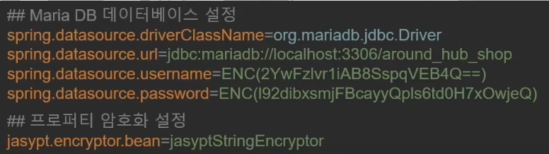

5. ENC() 암호화 인식 동작 확인

### 공식 페이지
www.jasypt.org  
https://github.com/ulisesbocchio/jasypt-spring-boot#use-you-own-custom-encryptor

---

### 프로파일
- 스프링 부트에서는 서버의 환경에 맞춰 애플리케이션의 설정을 다르게 설정할 수 있는 '프로파일' 기능 제공
- 프로파일을 통해 다음과 같은 설정 가능
  - 특정 환경에서 실행할 Bean 설정
  - 특정 환경에서 사용할 프로퍼티 파일 설정

### @Profile
- 특정 환경에서 실행할 Bean을 설정하기 위해서는 @Profile 사용
> @Profile("dev")  
> - 'dev' 환경에서 실행하겠다는 의미

- 연산자를 통한 표현도 가능
> @Profile("!dev")
> - 'dev' 환경에서는 실행하지 않겠다는 의미

- @Profile과 같은 곳에서 사용되는 환경의 선언은 대체로 JVM 시스템 변수로 전달함
> -Dspring.profiles.active=dev
> 
> 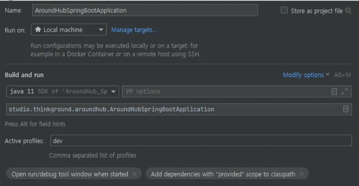

- 2.4버전 이후부터는 application.properties 파일에서 프로파일 별 속성을 구분하여 지정 가능
>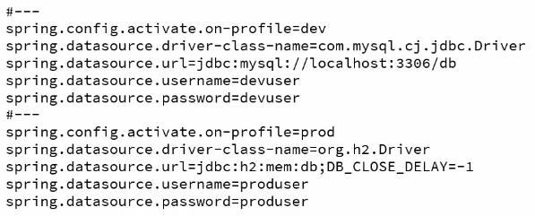
